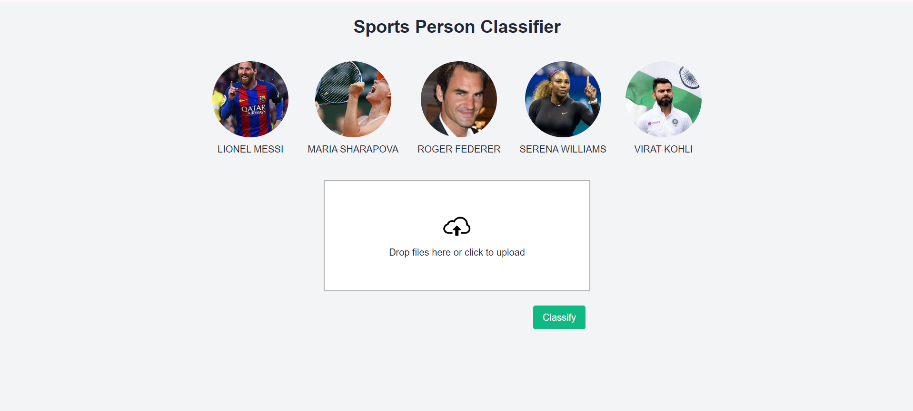
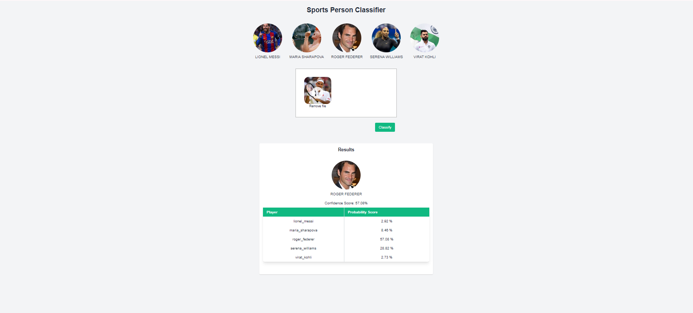

### **README.md**


# Celebrity Face Detection and Classification

## Overview

This project is a web-based application that utilizes machine learning to detect and classify celebrity faces in images. Users can upload images, and the application will identify the celebrities present, displaying their names and confidence scores. The system is capable of handling multiple faces in a single image, showing separate results for each detected face.

## Project Structure

- **client/**: Contains the frontend code, including HTML, CSS, and JavaScript files, responsible for the user interface.
- **model/**: Includes the machine learning model and associated scripts for face detection and classification.
- **server/**: Contains the backend code powered by Flask, which handles API requests and serves the classification model.
- **requirements.txt**: Lists all Python dependencies required to run the project.
- **Procfile**: Used for deploying the application on platforms like Heroku.

## Setup Instructions

### 1. Clone the repository:

```bash
git clone <repository_url>
```

### 2. Navigate to the project directory:

```bash
cd Celebrity-face-detection
```

### 3. Install the required dependencies:

```bash
pip install -r requirements.txt
```

### 4. Run the server:

```bash
python server/server.py
```

This will start the Flask backend server that serves the machine learning model.

### 5. Run the client:

If the client is a static site, you can serve it using a simple HTTP server:

```bash
cd client
python -m http.server
```

### 6. Access the application:

Once both the server and client are running, you can access the application in your browser at `http://localhost:5000` or the specified port.

## Model Details

The project utilizes a machine learning model that performs face detection and celebrity classification. The model has been trained on a dataset of celebrity images and can recognize multiple faces in a single image, returning the names of the detected celebrities along with confidence scores.

## Deployment

The project is designed to be easily deployed on platforms like Heroku. The `Procfile` contains the necessary commands to run the application on Heroku.

### Steps to deploy:

1. **Create a Heroku app**:

   ```bash
   heroku create your-app-name
   ```

2. **Push the code to Heroku**:

   ```bash
   git push heroku main
   ```

3. **Scale the web process**:

   ```bash
   heroku ps:scale web=1
   ```

4. **Open the application**:

   ```bash
   heroku open
   ```

## Example Screenshots

- **Upload Interface**:
  
  *Description*: This is where users can drag and drop images for classification.

- **Single Celebrity Detected**:
  
  *Description*: The application detects and classifies a single celebrity in the uploaded image.

- **Multiple Celebrities Detected**:
  
  *Description*: When multiple celebrities are detected, the application displays results for each detected face.

## License

This project is licensed under the MIT License. See the [LICENSE](LICENSE) file for more details.

## Acknowledgments

- Thanks to Google
- Special thanks to the developers of the libraries and tools that made this project possible.
- Special thanks to Codebasics for helpful tutorials
```
